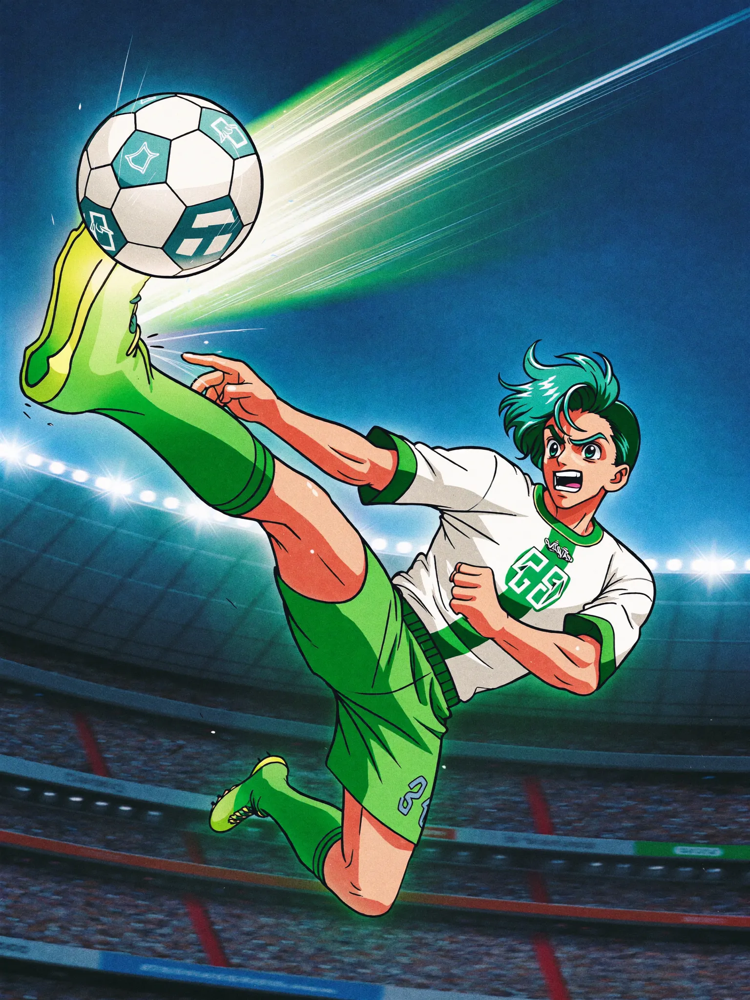

# Golazo

A World Cup trading-card game on Solana devnet. Buy card packs with devnet
SOL, collect players rated from their real 2022 World Cup statistics, play
five-a-side simulated matches against AI squads, and follow World Cup 2026
scores fed exclusively by **TxODDS TxLINE**.

**Play it: https://golazo-web-production.up.railway.app** (devnet wallet +
free airdrop button in-app).

There is no game database. Each pack purchase is a transaction: the program
takes the pack price and stores a random 32-byte seed in a per-pack account.
The client derives the pack's five cards from that seed, so a wallet's whole
collection is reconstructed from its on-chain accounts alone. The only
backend is a thin stateless proxy that relays TxODDS match data (its
credentials are wallet-gated secrets that cannot live in the browser).



## Editions

Two card sets, each an independent game (own cards, own on-chain program, own
collection and squads), switchable in the header:

- **World Cup 2026** — 696 players generated from the live TxODDS feed. Ratings
  come from real squad, position, starter role, appearances, and each team's
  goals for/against in the tournament so far. Re-run
  [scripts/gen-wc26.mjs](scripts/gen-wc26.mjs) as the tournament progresses to
  update the set.
- **World Cup 2022** — 111 players hand-authored from the 2022 tournament's
  final per-player lines.

## Gameplay

- **Packs** — 5 cards each. The final slot is always RARE or better.
- **Cards** — the four ability stats (ATT / PAS / DEF / PHY) drive an overall
  rating and rarity tier (COMMON / RARE / ELITE / LEGEND), computed weighted by
  position. Every card face shows the player's real tournament line.
- **Squads** — 5 cards: exactly 1 goalkeeper, at least 1 defender and
  1 forward.
- **Matches** — simulated minute by minute with a text commentary log;
  draws are settled on penalties. Results are deterministic for a given
  pair of squads and seed. Three AI difficulty tiers.
- **Match center** — the LIVE tab shows World Cup 2026 fixtures (teams,
  scores, match clocks) read from the TxODDS TxLINE feed — the app's sole
  source of match data.

The card artwork is original anime-style illustration (one archetype per
position) — no player likenesses are used; only factual names and statistics
appear on the cards.

## Quick start

```bash
npm install
cp .env.example .env   # ships the live devnet program id
npm run dev            # http://localhost:5173
```

Connect a Solana wallet (Phantom, Solflare, Backpack) set to **devnet** and
fund it: `solana airdrop 2 <pubkey> --url devnet`.

Without a `.env` (or with `VITE_PACK_PROGRAM_ID` left blank) the app runs in
**free play**: packs open locally with random seeds and no SOL is needed.
The header shows which mode is active.

## Live deployment

| | |
| --- | --- |
| Frontend | https://golazo-web-production.up.railway.app |
| Data service (TxODDS proxy) | https://golazo-data-production.up.railway.app/api/health |
| WC2022 program | [`GZUkNP4HhCdqZfZdQFhruArdz5oQ4Y8mgiS9wNPWc1ZL`](https://explorer.solana.com/address/GZUkNP4HhCdqZfZdQFhruArdz5oQ4Y8mgiS9wNPWc1ZL?cluster=devnet) |
| WC2026 program | [`AY43PC3k3g1s8hBxZamVWubw35XDBBCHZBEg5ZeuLsJ2`](https://explorer.solana.com/address/AY43PC3k3g1s8hBxZamVWubw35XDBBCHZBEg5ZeuLsJ2?cluster=devnet) |
| Cluster | devnet (upgradeable) |
| Pack price | 0.05 SOL (each edition) |

Both editions run the same program bytecode under separate ids, so their
packs, collections, and per-wallet counters never cross.

## Match data: TxODDS TxLINE

All match data — teams, scores, clocks — comes exclusively from
[TxODDS](https://www.txodds.com) **TxLINE**, whose access is itself
Solana-native: a wallet subscribes on-chain to a service tier, then activates
an API token and a short-lived guest JWT. [server/index.mjs](server/index.mjs)
is a zero-dependency proxy that holds those credentials, discovers the
fixtures the subscription covers, and serves them to the frontend
(`/api/live`), caching results and never letting a throttled upstream read
shrink the scoreboard. The current session covers 17 World Cup 2026 group
fixtures at the free tier (~60s delay).

### Instructions

| Instruction           | Signer        | Effect |
| --------------------- | ------------- | ------ |
| `initialize`          | first caller  | create the `["config"]` PDA, set the pack price, become authority |
| `buy_pack(max_price)` | anyone        | pay the price (rejected if it now exceeds `max_price`) and mint the buyer's next `["pack", buyer, n]` PDA with a committed seed |
| `set_pack_price`      | authority     | update the price |
| `withdraw`            | authority     | withdraw pack revenue, keeping the config rent-exempt |

The frontend client is IDL-free: instructions are built by hand from the
Anchor discriminators and account layouts (see
[src/solana/packs.js](src/solana/packs.js)).

## Repository layout

```
src/game/          card sets (players.js, players2026.js), editions, pack
                   derivation, match simulator, storage (+ tests)
src/solana/        program client, usePacks/useBalance hooks
src/components/    shop, collection, squad builder, arena, match center, edition switcher
programs/golazo/   Anchor program (Rust)
server/            TxODDS TxLINE proxy (zero-dependency Node)
scripts/           config init + WC26 card generator
tests/             Anchor integration tests
```

## Testing

```bash
npm test        # engine, card DB, and full game-loop integration (Vitest)
npm run lint    # oxlint
```

CI runs lint, tests, and the production build on every push
([.github/workflows/ci.yml](.github/workflows/ci.yml)).

[tests/golazo.ts](tests/golazo.ts) documents the on-chain suite; running it
requires the Anchor CLI plus `ts-mocha`/`mocha`/`chai`, which are not part of
this package.json.

## Deploying a program yourself

Build with the Solana toolchain; the Anchor CLI is optional. Each edition is a
separate deployment of the same bytecode, so build it with that edition's id
in `declare_id!`:

```bash
solana-keygen new -o target/deploy/edition-keypair.json      # the program id
# set that id in programs/golazo/src/lib.rs (declare_id!), then:
cargo build-sbf
solana program deploy target/deploy/golazo.so \
  --program-id target/deploy/edition-keypair.json \
  --keypair <funded-devnet-wallet.json> --url devnet

# Immediately afterwards (initialize is first-come-first-served):
node scripts/init-config.mjs <PROGRAM_ID> 0.05 <funded-devnet-wallet.json>
```

Restore `declare_id!` to the committed WC22 id afterwards. A redeployed id must
also be updated in [Anchor.toml](Anchor.toml), the matching `VITE_PACK_PROGRAM_ID*`
in `.env` / [.env.example](.env.example), and the `ARG` default in the
[Dockerfile](Dockerfile) (Docker builds do not read `.env`).

### Refreshing the WC26 card set

```bash
# with the TxLINE session reachable, cache the snapshots, then:
node scripts/gen-wc26.mjs        # writes src/game/players2026.js
```

### Player card art (free, no API key)

Each card can have its own generated anime art (public/cards/players/<id>).
Cards without an image fall back to the position archetype.

```bash
node scripts/gen-card-prompts.mjs        # 1. write card-prompts.jsonl (one prompt/card)
python3 scripts/gen_card_art.py          # 2. generate via Pollinations (free; --priority-only for legends/elites)
node scripts/gen-card-art-manifest.mjs   # 3. update the manifest, then rebuild/redeploy
```

`gen_card_art.py` is resume-safe (existing files are skipped) and stdlib-only.
`node scripts/gen-card-art.mjs` does the same from Node (`--provider=google`
for a paid Imagen/Gemini key instead of the free default). The free tier is
rate-limited (~1 image / 35s), so a full 696-card run grinds for a few hours —
re-run any time to continue where it left off.

## Hosting

Two Railway services:

- **golazo-web** — static Vite build via the root [Dockerfile](Dockerfile);
  public config is passed as build args (`VITE_SOLANA_CLUSTER`,
  `VITE_PACK_PROGRAM_ID`, `VITE_PACK_PROGRAM_ID_2026`, `VITE_SOLANA_RPC_URL`,
  `VITE_DATA_API_URL`). [vercel.json](vercel.json) covers Vercel as an alternative.
- **golazo-data** — [server/Dockerfile](server/Dockerfile); configured with
  `TXLINE_JWT`, `TXLINE_API_TOKEN` (or a single `TXLINE_SESSION_JSON`),
  `TXLINE_FIXTURE_RANGE`, and `CORS_ORIGIN` scoped to the frontend origin.

## Design notes and limitations

- **Each card set is a frozen edition.** Pack contents are a function of
  (seed × card set), so editing a set re-derives every historical pack. A
  refreshed set (e.g. WC26 later in the tournament) ships as a new edition and
  deployment rather than an in-place edit.
- **WC26 ratings are team-attributed.** Match snapshots don't retain
  individual goal scorers, so attacking/defensive quality is derived from each
  team's real results and shaped by the player's position and starter role —
  not from individual goals.
- **Seed randomness is devnet-grade.** The pack seed is
  `keccak(buyer, count, slot, timestamp)`, which is predictable enough that a
  production release would replace it with a VRF. The client would not change.
- **Battles are simulated client-side** and are not part of on-chain state.
- Player names and statistics are factual tournament data; artwork is
  original. A commercial release would still need a review of name/statistic
  licensing (FIFPro or national associations).

## License

MIT — see [LICENSE](LICENSE).
